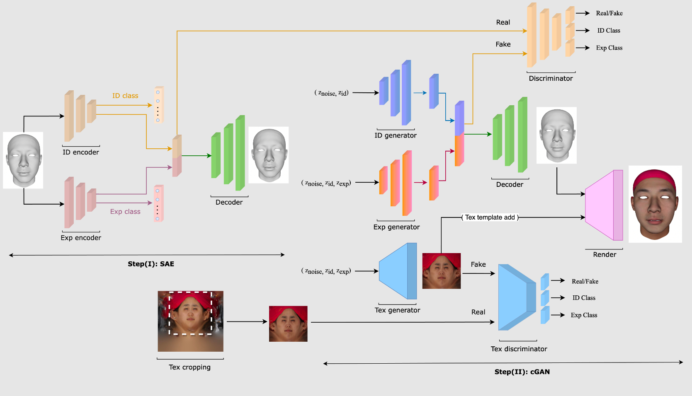

# Controllable 3D Generative Adversarial Face Model via Disentangling Shape and Appearance

Fariborz Teherkhani, Aashish Rai*, Shaunak Srivastava*, Quankai Gao*, Xuanbai Chen, Fernando de la Torre, Steven Song, Aayush Prakash, Daeil Kim (* equal contribution)

### Carnegie Mellon University, Facebook/Meta

This is the official Pytorch implementation of the paper.

### More details coming soon!


[[Project Page]](https://aashishrai3799.github.io/3DFaceCAM) [[Video]](https://drive.google.com/file/d/1PqIN4Rzp4vapWs2pUegUEoMhg4lM2Smy/view?usp=sharing) [[Colab Demo]](#) [[Arxiv]](https://arxiv.org/abs/2208.14263) 



## Testing

Download pre-trained weights and put the "checkpoints" folder in the main directory. [[Link]](https://drive.google.com/file/d/1hK31wVAoieRiVFydPxnx0MVpx6AnWN1-/view?usp=sharing)

- Generate 3D Faces (mesh and texture)
    ```
    python generate_faces.py
    ```
    
- Generate meshes only
    ```
    python test_gan3d.py
    ```
    
- Generate textures only
    ```
    python test_texture.py
    ```

## Train your own model

### Preprocess data

    - Download Facescape dataset and specify path to the "facescape_trainset" folder.
    
    python preprocess_traindata.py
    

### Start training

- Shape
    ```
    Train AE
    python train_ae.py 
    ```
    ```
    Generate Reduced Data
    python gen_reduced_data.py 
    ```
    
    ```
    Train GAN
    python train_gan3d.py 
    ```

- Texture
    ```
    Train P-GAN
    python train_texture.py --init_step 1 --batch_size 128
    ```

## License

The code is available under MIT License. Please read the license terms available at [[Link]](https://github.com/aashishrai3799/3DFaceCAM/blob/main/LICENSE)

## Citation

If you use find this paper/code useful, please consider citing:

```
@inproceedings{farib2022facemodel,
  title={Controllable 3D Generative Adversarial Face Model via Disentangling Shape and Appearance},
  author={Fariborz Teherkhani and Aashish Rai and Shaunak Srivastava and Quankai Gao and Xuanbai Chen and Fernando de la Torre and Steven Song and Aayush Prakash and Daeil Kim},
  booktitle={arxiv},
  year={2022}
}
```


